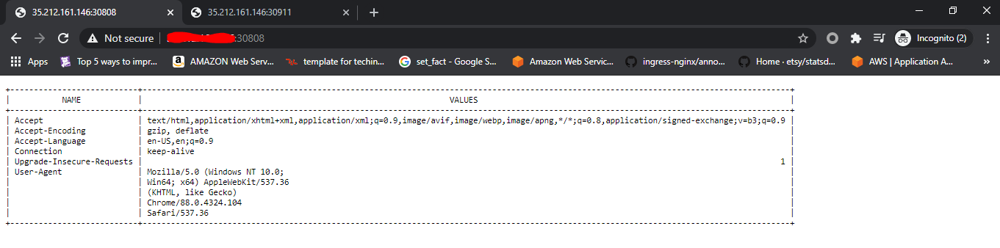
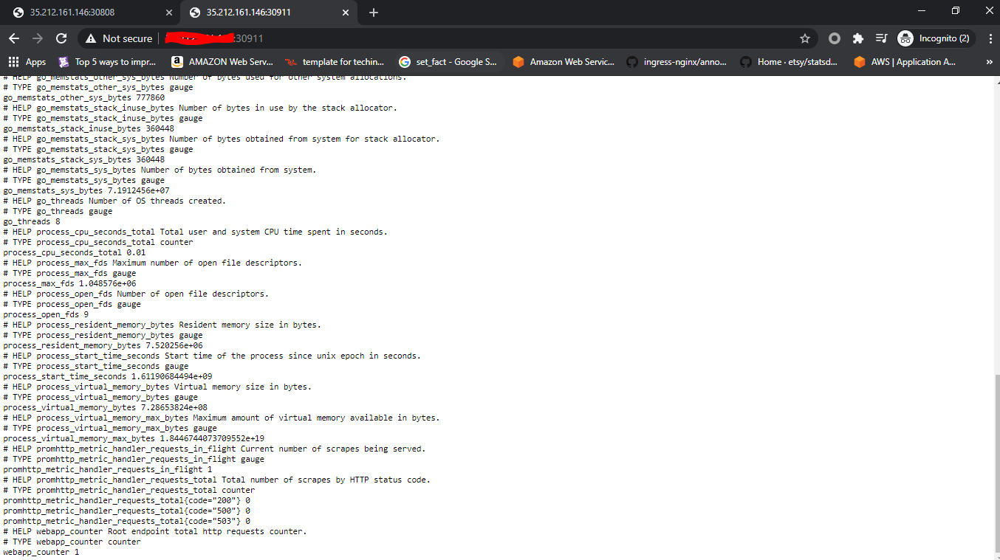
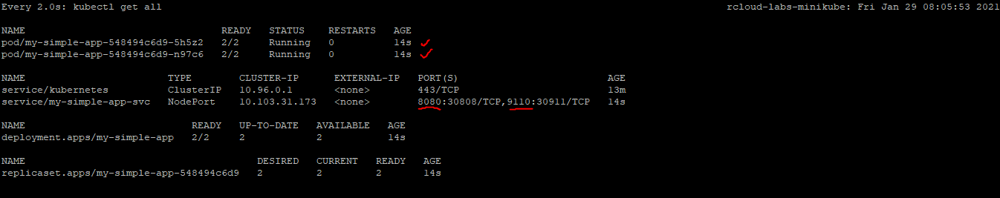

# Golang Simple App

My simple app for display http request headers in table format. Sorted by header name and listening on port 8080. It's also provided by sidecar for counting number of request using prometheus client. Listening on port 9110.

## Requirements

For deploying this apps, you need to prepare some requirements first, such as:
  - Kubernetes cluster (In this example I use minikube)
  - Helm v3
  - Kubectl 
  - Container runtime
  - Git

## How to deploy

You just need to download this github repository to your workstation and change directory to "charts/my-simple-app" and execute this command:

`sudo helm install -f ./values.yaml my-simple-app .`

To verify the installation 

`sudo helm list`

for delete this app from your kubernetes cluster just run this command: 

`sudo helm delete my-simple-app`

## Results

To accessing the app open your browser or use some net tools like "curl" and go to your public_IP:port number and you will get http response like shown below

> Notes: Since this app use nodePort type in its kubernetes service. The port number to accessing this app is under "30808" and for prometheus client http counter is under "30911. It's happen because kubernetes standard ports range for service with type NodePort are 30000-32767. Do not forget to allow those ports in your firewall system.

### main_app

### prometheus_counter

### All Cluster resources

